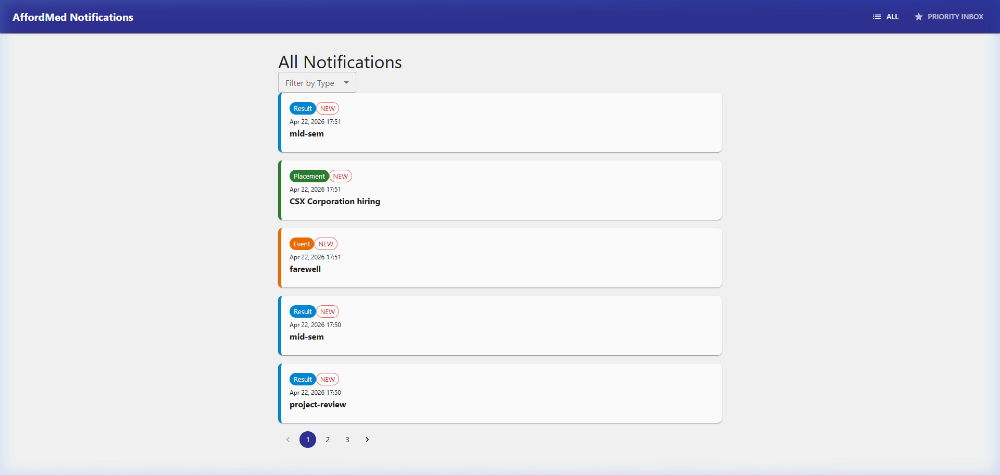
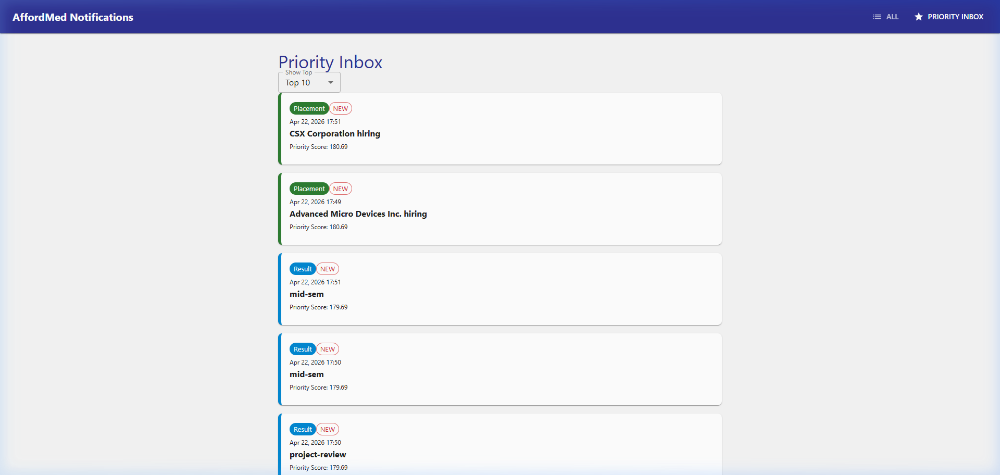
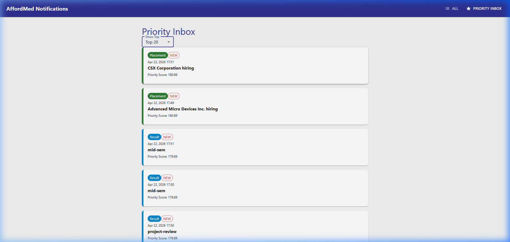
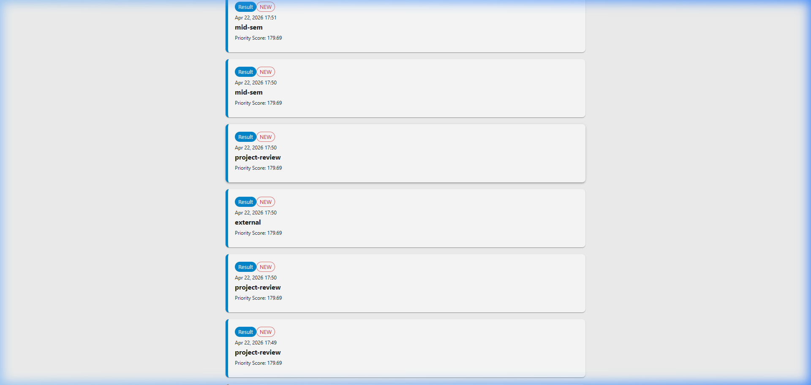

# Campus Notifications Project

This repository contains the full stack implementation for the Campus Notifications system.

## Project Structure

- [notification_app_fe/](./notification_app_fe/): React frontend application.
- [notification_app_be/](./notification_app_be/): Backend API server.
- [logging_middleware/](./logging_middleware/): Custom logging middleware implementation.
- [notification_system_design.md](./notification_system_design.md): System architecture and design documentation.

## Demo Video

A demonstration of the application can be found here: [Recording 2026-05-06 163249.mp4](./notification_app_fe/public/Recording%202026-05-06%20163249.mp4)

## Screenshots Gallery

### All Notifications

### Priority Inbox

### Priority Inbox (Top 20 Filter)

### Priority Inbox (Scrolled View)

